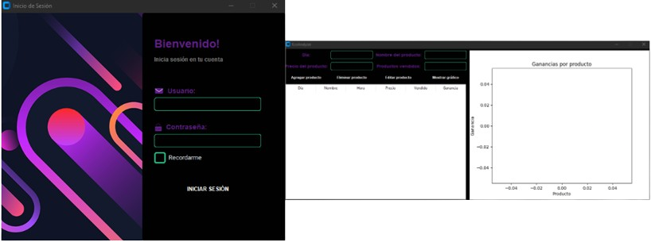

# EcoAnalyzer

El **EcoAnalyzer** es una aplicación de software diseñada para facilitar el seguimiento y análisis detallado de las actividades financieras de los usuarios.

Permite a los usuarios:

- Iniciar sesión en su base de datos personal.
- Ingresar datos diarios de ventas, incluyendo nombre del producto, valor y cantidad vendida.
- Ver y editar los datos ingresados en una tabla interactiva.
- Eliminar datos si es necesario.
- Visualizar gráficos que muestran las ventas de productos y las ganancias generadas.



## Instalación

1. Clona este repositorio:

   ```bash
   git clone https://github.com/sebitabravo/EcoAnalyzer.git
   ```

2. Accede al directorio del proyecto:

   ```bash
   cd EcoAnalyzer
   ```

3. Ejecuta el archivo "**run**.py":

   ```bash
   python run.py
   ```

## Instalación Manual Modulos (Opcional)

1. Instala los módulos necesarios:

   - PIL (Python Imaging Library)
   - CustomTkinter
   - Matplotlib

   Puedes instalarlos usando `pip`:

   ```bash
   pip install Pillow customtkinter matplotlib
   ```

## Uso

1. Por defecto, se incluye un usuario administrador:

   - **Usuario:** admin
   - **Contraseña:** 1234

2. Inicia sesión con este usuario para acceder a la base de datos por primera vez.

3. Ingresa los datos de ventas diarias: día, nombre del producto, valor y cantidad vendida.

4. Utiliza la tabla interactiva para visualizar, editar o eliminar datos ingresados.

5. Accede al botón de visualización de gráficos para analizar las ventas por producto y las ganancias generadas.

## Contribución

¡Bienvenidas sean las contribuciones! Este proyecto fue creado como parte de mi curso universitario en mi primer año. Si tienes ideas para mejorar este proyecto, corregir errores o agregar nuevas funcionalidades, ¡estoy emocionado por recibir tu ayuda!

Por favor, siéntete libre de crear "Issues" para reportar errores o sugerir mejoras. Si quieres contribuir directamente con código, puedes hacerlo mediante solicitudes de extracción (pull requests). Todas las contribuciones serán revisadas y consideradas para mejorar este proyecto.

¡Gracias por tu interés en mejorar este trabajo universitario!

## Licencia

Este proyecto es un trabajo personal y todos los derechos sobre el código y los recursos utilizados pertenecen al creador, Sebastian Bravo. No se concede ninguna licencia explícita para el uso, modificación o distribución del código y otros recursos asociados a menos que se otorgue permiso por escrito del propietario del proyecto.
